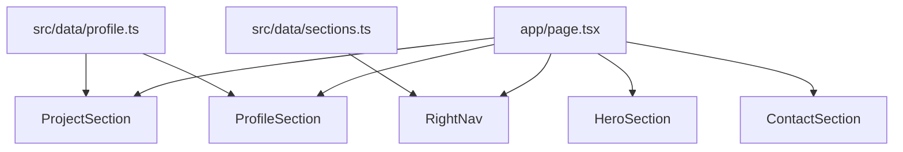

# Portfolio (Next.js)

개인 포트폴리오 사이트입니다. 섹션별 데이터를 `src/data`에서 관리하고, Framer Motion으로 자연스러운 인터랙션을 제공합니다.

## Highlights
- Hero / Profile / Project / Contact 섹션 구성
- 프로젝트 캐러셀 + GitHub/PDF 링크 버튼
- 데이터 중심 구조 (`src/data/profile.ts`, `src/data/sections.ts`)

## Stack
- Next.js (App Router)
- React
- Tailwind CSS
- Framer Motion

## Structure
```
src/
  app/
    page.tsx
  components/
    HeroSection.tsx
    navigation/RightNav.tsx
    sections/
      ProfileSection.tsx
      ProjectSection.tsx
      ContactSection.tsx
  data/
    profile.ts
    sections.ts
```

## Data Flow


## Project Demo PDF
프로젝트 카드의 `PDF` 버튼은 모달로 PDF를 열고 특정 페이지로 이동합니다.

- PDF는 `public/` 아래에 둡니다.
- `links.demo`에 PDF 경로를 넣고, `links.demoPage`로 페이지 번호를 지정합니다.

예시:
```ts
links: {
  demo: "/pdfs/review.pdf",
  demoPage: 3,
  github: "https://github.com/your/repo"
}
```

## Getting Started
```bash
npm install
npm run dev
```

## Build
```bash
npm run build
npm run start
```
