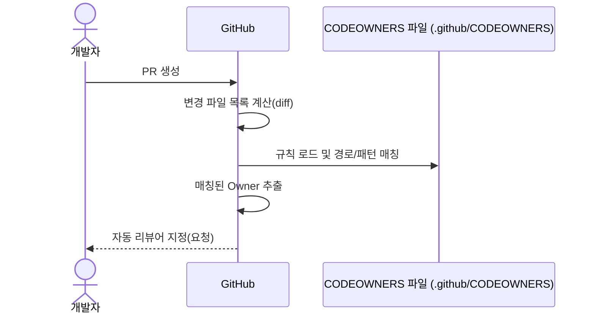

## CODEOWNERS

"이 코드의 책임자(리뷰어)가 누구인지"를 GitHub에 알려주는 설정 파일

프로젝트 규모가 커질수록 코드의 소유권(Ownership)을 명확히 할 필요가 있다.
CODEOWNERS 파일을 사용하여 책임과 권한을 명시한다.

## 파일 생성 위치

CODEOWNERS 파일은 다음 위치 중 하나에 둘 수 있다.

- .github/CODEOWNERS (권장)
- CODEOWNERS (repository root)
- docs/CODEOWNERS

## 동작 과정



1. 규칙 정의: CODEOWNERS 파일 안에 특정 폴더나 파일 패턴, 그리고 그 담당자의 GitHub ID 또는 팀(GitHub Team) 명시
  ```
    # 특정 폴더 전체
    /lib/services/payment/   @org-name/team-name

    # 특정 파일
    /lib/main.dart           @user-name

    # 모든 dart 파일
    *.dart                  @org-name/frontend-team
  ```

2. PR 발생: 누군가 Pull Request (PR) 생성

3. 자동 리뷰 요청: GitHub가 PR에서 변경된 파일들을 확인하고, CODEOWNERS 파일에 정의된 규칙과 일치하는 담당자(Owner)가 있는지 탐색

4. 리뷰어 지정: 만약 일치하는 담당자가 있다면, 그 사람(또는 팀)을 자동으로 해당 PR의 리뷰어로 추가

> **CODEOWNERS 우선순위**  
> CODEOWNERS는 위에서 아래로 평가되며, 가장 마지막에 매칭된 규칙이 적용된다.
> 예)
> ```
>   *.dart          @org-name/frontend-team
>   /lib/main.dart   @project-lead-user
> ```
> lib/main.dart는 **frontend-team이 아니라 project-lead-user**가 담당

- CODEOWNERS 파일은 .gitignore 문법과 유사하게 동작한다.
- 저장소 설정에 따라, 이 CODEOWNERS로 지정된 사람의 승인을 받아야만 PR을 병합(Merge)할 수 있도록 강제할 수 있다.
- GitHub는 기본 브랜치(default branch)에 있는 CODEOWNERS 파일만 기준으로 동작한다.