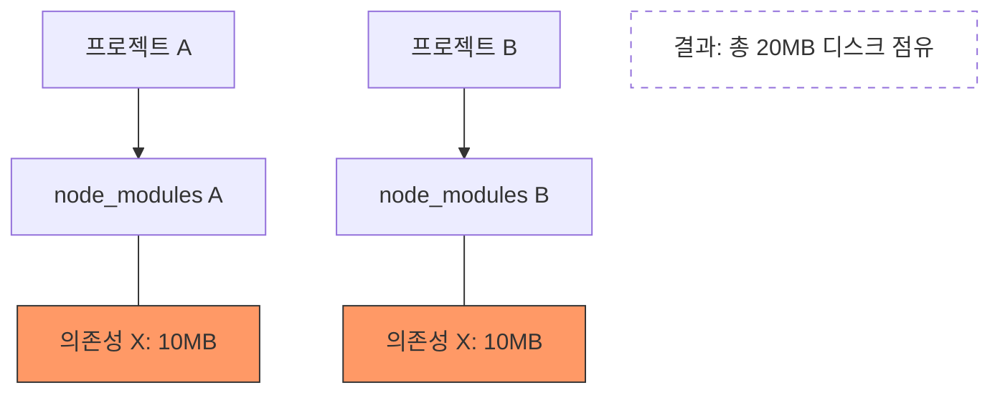
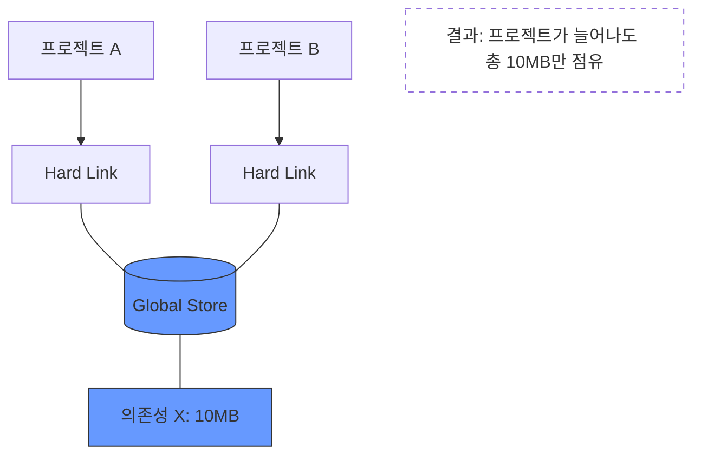

프로젝트를 할 때, 팀원들과 패키지 매니저에 대해 논의한 적이 있다.  
당시에는 빠른 패키지 설치 속도, 유령 의존성 이슈로 인해 pnpm을 사용하기로 결정했었는데,  
다른 패키지 매니저들의 장단점을 비교해보고자, 각 3가지에 대해 정리해 보았다.

> **유령 의존성(Phantom Dependency)**  
> `package.json`에 사용자가 명시하지 않은 라이브러리를 사용할 수 있게 되는 것,  
> pnpm은 이를 허용하지 않아 협업 시 에러를 줄일 수 있다.

## npm

- Node.js 기본 내장
- 가장 범용적이고 호환성이 좋음
- 대규모 monorepo에서는 속도/디스크 효율이 아쉬울 수 있음

## pnpm

- **콘텐츠 주소 기반 스토어 + 하드링크** 방식
- 설치 속도 빠르고 디스크 사용량 최소화
- 링크 구조로 인해 일부 레거시 도구와 충돌 가능

## yarn

- 설치 속도 개선과 워크스페이스 지원에 강점
- v1, v2+ (Berry) 차이가 커서 팀 내 통일이 중요
- PnP 모드 사용 시 호환성 이슈가 생길 수 있음

## npm vs. pnpm vs. yarn

| 구분 | npm | pnpm | yarn (Berry 기준) |
| --- | --- | --- | --- |
| 설치 속도 | 보통 | 매우 빠름 | 빠름 |
| 디스크 사용 | 높음 (중복 저장) | 매우 낮음 (공유 저장) | 낮음 |
| 저장 방식 | 평탄한(Flat) 구조 | 하드 링크 & 심볼릭 링크 | PnP (Plug'n'Play) |
| 엄격함 | 낮음 (유령 의존성 허용) | 높음 (엄격한 관리) | 높음 (PnP 사용 시) |
| 오프라인 설치 | 캐시 기반 | 강력한 캐시 지원 | Zero Installs 지원 |

### npm / yarn v1: 중복 저장 방식
각 프로젝트마다 물리적으로 동일한 패키지를 중복해서 소유하여 디스크 용량을 많이 차지하는 구조

### pnpm: 콘텐츠 주소 기반 저장 방식
전역 스토어(Global Store)에 단 하나만 저장하고,  
각 프로젝트는 이를 참조(Hard Link)만 하여 용량을 획기적으로 줄이는 구조

## 결론

개인적으로는 늘 호환성을 우선시하여 npm으로 시작했지만,  
팀원들과의 협업을 위해 pnpm, yarn 또한 필요함을 알게되었다.  
그리고 무엇보다 **팀 규칙과 CI 환경에 맞게 일관성 있게 고르는 것**이 핵심이라고 생각했다.
